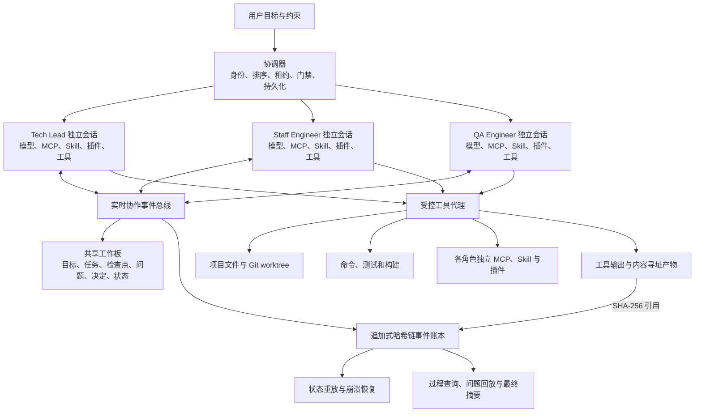
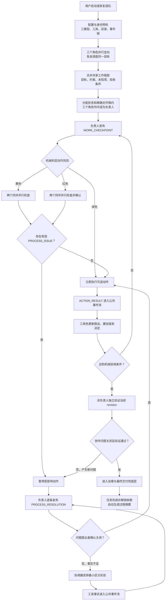

# 鞍钢宪法式三 AI 持续协作协议设计

> 状态：待用户审核
> 日期：2026-07-29
> 适用主线：`pi-agent` 的 `/ansteel-team`
> 核心决策：固定专业分工、对等质疑权、持续公开协作、风险分级阻断、哈希链审计、末端独立验收

## 一、执行摘要

本设计把 Ansteel Team 从“一个角色完成工作、两个角色事后审查”的交付审批系统，重构为三个 AI
持续共同工作的工程团队。

Tech Lead、Staff Engineer 和 QA Engineer 保留固定的专业身份，但不存在固定的“被审查者”和
“审查者”。任何角色提出判断、计划、代码或测试时，该角色就是这项工作的临时负责人，另外两个角色
有权同时理解、补充、质疑、验证和纠正。问题必须在工作过程中解决，不能等到最终报告生成后再集中审批。

鞍钢宪法在系统中承担协议桥梁：

- “两参”要求三个角色都参加思考、决策和实际劳动；
- “一改”要求方案在形成和执行过程中不断接受质疑并修正；
- “三结合”要求架构、实现和质量视角作用于同一项工作，而不是分别生成互不相干的报告；
- “事实挂帅”要求工具输出、代码、测试和可定位来源成为共同判断基础；
- “有错必纠”要求问题提出者和责任人完成可追溯的纠正闭环；
- QA 否决权只保护有证据支持的正确性、安全和验收边界，不构成角色等级。

系统不要求或依赖模型供应商暴露私有隐藏思维链。它要求每个角色像工程师在共享白板、结对编程和设计
讨论中一样，持续外化对团队有用的工作推理：目标、假设、依据、不确定点、下一动作、预期结果、工具
观察和认知变化。

## 二、背景与现有偏差

当前 `/ansteel-team` 已经具备三个持久角色会话、受控文件修改、真实测试、冻结 Git diff、双同行评审、
事件日志和长任务恢复机制。这些能力适合保护最终交付，但当前主循环仍然以以下路径为中心：

```text
owner 完成修改
  -> 提交测试与冻结 diff
  -> 两名非 owner 分别审查证据包
  -> 批准或退回
```

耐久租约队列真实编码探针证明这条路径可以完整运行，也暴露了它的根本不足：公开测试和原有隐藏测试均
通过、两名审查者均批准之后，新增对抗测试仍发现安全整数溢出和 `__proto__` 键丢失。问题不仅是测试覆盖
不足，更是审查发生得太晚。审查者看到的是 owner 整理后的结果，而不是 owner 如何理解数据边界、如何
选择 canonicalization 策略、为何认为时间计算安全，以及工具结果是否真的支持这些判断。

因此，本设计把主审查面从“最终证据包”前移到“正在形成的公开工作推理和动作意图”。独立测试、治理
审批和最终交付状态继续保留，但降为末端安全网。

## 三、目标

完成本设计后，系统必须实现以下能力：

1. 三个角色拥有独立模型会话、独立工具配置和持续可恢复的项目上下文。
2. 三个角色围绕同一份共享工作状态协作，不通过三份独立报告拼接结论。
3. 任一角色都可以负责实际任务，也可以对其他角色的判断提出有依据的质疑。
4. 关键判断和动作发生前，负责人必须发布可公开审查的结构化工作检查点。
5. 审查者可以在被审查者继续扩大错误之前提出问题并阻断受影响动作。
6. 被审查者必须接受、反证、试验或修改方案，不能用一段总结代替问题解决。
7. 工具结果自动进入公共事实流，所有角色依据相同事实更新认识。
8. 运行数小时、角色超时、进程退出或主机重启后，可以从最后一个有效协作检查点恢复。
9. 所有公开协作事件只追加、可查询、可重放，历史修改可以被哈希链检测。
10. 最终完成状态仍需独立验证，不允许用协作共识代替交付正确性。

## 四、非目标

本阶段明确不实现以下内容：

- 不获取、记录或转发模型供应商的私有隐藏思维链；
- 不记录 API Key、认证头、环境变量、个人数据或未经裁剪的敏感工具输出；
- 不让三个角色无约束地同时修改同一个文件；
- 不把协调器变成第四个架构、实现或会签角色；
- 不要求每次读取文件、搜索代码或普通对话都等待两次审批；
- 不使用公有链、代币、挖矿或分布式区块链共识；
- 不承诺三个不同配置一定对应三个真实独立的后端模型，仍需运行时 canary 验证；
- 不承诺协作共识一定正确，最终验证与现实系统测试仍不可替代。

## 五、方案比较与选择

### 方案 A：固定轮次讨论

三个角色按 TL、Staff、QA 的固定顺序发言，再进入下一轮。

优点是实现简单、顺序确定。缺点是角色容易生成三份长报告，后发言者只能事后评论，无法在工具调用和
实现选择发生时及时纠正；长任务会被轮次和文本长度放大。

### 方案 B：持续协作总线与风险分级检查点

三个角色保持独立会话，通过公共事件总线观察同一任务。角色在关键判断和动作前发布工作检查点，其他
角色可以并行质疑和验证；是否阻断由动作风险和问题严重度共同决定。

优点是最接近理想工程团队：角色可以并行劳动，质疑能发生在错误扩散之前，低风险调查不被审批拖慢，
高风险操作又保留明确门禁。缺点是需要结构化事件协议、并发排序、文件租约和恢复状态机。

### 方案 C：完全自由共享工作区

三个角色随时发言、调用工具和修改任何文件，不设置结构化检查点。

优点是表面自由度最高。缺点是容易产生写入冲突、重复调查、上下文风暴、伪共识和无法重放的状态；最终
很难判断某项决定基于什么事实。

### 选择

采用方案 B。方案 A 只作为单个复杂争议的临时讨论形式，方案 C 不进入主产品。

## 六、总体架构



### 6.1 三个独立角色运行时

每个角色必须拥有独立的：

- provider/model 配置和运行时 canary；
- 会话文件与上下文窗口；
- MCP 服务器清单；
- Skill 与插件清单；
- 工具权限、调用预算和超时策略；
- 角色签名身份。

一个角色安装或启用的 MCP、Skill 或插件不自动授予其他角色。多个角色可以同时调用各自的辅助工具，
但所有项目写入仍经过统一工具代理和文件租约检查。

### 6.2 协调器

协调器只执行机械职责：

- 验证三种不同且可解析的 provider/model 身份；
- 创建和恢复角色会话；
- 为并发事件分配全局递增序号；
- 广播公共协作事件；
- 管理任务和文件写入租约；
- 根据风险等级执行门禁；
- 持久化事件、产物引用和派生状态；
- 检测无进展循环、角色失联和账本损坏；
- 在满足机械条件时推进状态。

协调器不能提出角色观点、关闭问题、替角色签字、把超时解释为同意，或把模型文本当作工具事实。

### 6.3 共享工作板

共享工作板是事件账本的可读投影，不是第二份可独立编辑的数据源。它至少显示：

- 当前目标、边界和验收条件；
- 三个角色及其运行状态；
- 当前任务、负责人和文件租约；
- 最新工作检查点与动作风险；
- 开放问题、阻断原因和责任人；
- 已确认的工具事实与置信度；
- 当前决定、保留异议和回退条件；
- 协作、治理和交付三个正交状态。

## 七、角色协议

### 7.1 固定专业分工

| 角色 | 主要专业责任 | 可以承担的实际劳动 |
|---|---|---|
| Tech Lead | 系统模型、架构边界、任务拆分、跨模块影响和整合 | 调查、原型、架构代码、集成修改、验证 |
| Staff Engineer | 实现路径、技术可行性、代码质量、性能和维护性 | 调查、编码、重构、测试、构建、验证 |
| QA Engineer | 反例、故障注入、安全、边界条件和验收完整性 | 调查、测试代码、测试夹具、静态检查、验证 |

### 7.2 对等协作权

三个角色都拥有以下权利和义务：

- 提出工作检查点和方案；
- 请求其他角色解释某个判断；
- 使用自己的工具独立核查公开事实；
- 对任何角色提出 `PROCESS_ISSUE`；
- 接受质疑并公开修正自己的判断；
- 在自己拥有租约的文件上实际工作；
- 对不属于自己专业视角的问题提供补充意见；
- 在证据不足时明确降低置信度或拒绝形成结论。

“Tech Lead”“Staff Engineer”和“QA Engineer”表示专业视角，不表示发言等级。Tech Lead 不能凭身份压过
工具事实，QA 不能为了否决而否决，Staff 不能因为是主要编码者而独占方案解释权。

### 7.3 动态审查关系

审查关系绑定具体工作对象，不绑定固定角色：

```text
谁发布 WORK_CHECKPOINT，谁是该检查点的临时负责人；
另外两个角色是该检查点的独立协作者和审查者；
谁发布 PROCESS_ISSUE，谁负责确认该问题是否被真实解决；
任务负责人仍负责在完成质疑闭环后作出可回退的执行决定。
```

## 八、公开工作推理协议

### 8.1 边界

系统审查的是“公开工作推理”，不是模型私有思维链。公开工作推理必须足以让另一名工程师理解并检查
即将发生的技术决定，但不要求输出逐 token 的内部联想。

以下时刻必须公开：

1. 首次形成问题理解和任务边界时；
2. 选择实现方案、数据结构、算法、依赖或兼容策略时；
3. 准备修改文件或执行黄色、红色动作前；
4. 工具结果与预期不一致时；
5. 原假设被推翻或置信度发生变化时；
6. 接受或反驳其他角色质疑时；
7. 准备宣布任务满足验收条件时。

### 8.2 工作检查点

`WORK_CHECKPOINT` 至少包含：

```json
{
  "checkpointId": "CP-TASK-LEASE-0007",
  "taskId": "TASK-LEASE",
  "actor": "staff-engineer",
  "goal": "修复事件日志恢复时的安全整数溢出",
  "currentUnderstanding": "租约过期时间由 clock 与 leaseMs 相加得到",
  "assumptions": [
    "clock 和 leaseMs 均应为非负安全整数"
  ],
  "evidenceRefs": [
    "artifact:sha256:..."
  ],
  "uncertainties": [
    "现有调用者是否可能传入接近 MAX_SAFE_INTEGER 的 clock"
  ],
  "nextAction": {
    "kind": "edit",
    "target": "src/lease-queue.mjs",
    "expectedResult": "所有无效时间在写日志前被拒绝"
  },
  "risk": "yellow",
  "confidence": "L2"
}
```

字段必须简洁、具体、可质疑。禁止使用“按最佳实践处理”“应该没问题”等不可验证表述。

### 8.3 质疑与解决

`PROCESS_ISSUE` 至少包含：

```json
{
  "issueId": "PI-TASK-LEASE-0003",
  "targetCheckpointId": "CP-TASK-LEASE-0007",
  "author": "qa-engineer",
  "severity": "blocking",
  "claim": "只验证输入不能证明相加结果仍是安全整数",
  "evidenceRefs": [
    "tool-result:sha256:..."
  ],
  "suggestedCorrection": "在任何事件写入前验证计算结果并增加溢出对抗测试"
}
```

负责人必须使用 `PROCESS_RESOLUTION` 选择一种精确结果：

- `ACCEPTED`：确认问题成立，修改检查点或方案；
- `REFUTED`：用新证据证明问题不成立；
- `EXPERIMENT_REQUIRED`：无法仅靠现有事实判断，提出最小区分实验；
- `SCOPE_ESCALATION`：问题涉及用户目标或不可逆范围变化，需要用户决定。

仅解释原观点、重复报告、降低问题严重度或宣称“已处理”都不构成解决。

### 8.4 工具观察

工具代理为每次工具调用自动生成 `ACTION_STARTED` 和 `ACTION_RESULT`。模型不能手工声称命令成功。

`ACTION_RESULT` 至少记录：

- 工具和参数的安全摘要；
- 发起角色和关联检查点；
- 开始与结束时间；
- 退出码、超时、信号或异常；
- 标准输出和标准错误的内容哈希及受控存储位置；
- 执行前后相关文件内容哈希；
- 是否符合检查点中的预期结果；
- 是否触发新的不确定项。

## 九、风险分级与阻断规则

| 等级 | 典型动作 | 协作规则 |
|---|---|---|
| 绿色 | 读取、搜索、列目录、只读分析、可丢弃实验 | 可以立即执行；事件广播给同伴，同伴可异步质疑 |
| 黄色 | 编辑文件、选择算法、增加依赖、改变测试策略、运行有副作用命令 | 先发布检查点；两名同伴并行检查；任何有效阻断问题暂停受影响动作 |
| 红色 | 删除或覆盖、权限与安全边界、迁移持久数据、提交、推送、发布 | 先发布检查点；两名同伴都必须明确确认；任何缺失、拒绝或超时均不执行 |

风险由动作类型、目标路径和项目策略机械计算。模型可以主动提高风险，但不能自行把协调器计算的风险
降低。普通读取中若发现凭据、协调器私有状态或越界路径，工具代理仍必须拒绝。

## 十、持续协作主流程



### 10.1 定向

三个角色先在隔离上下文中调查同一目标，避免第一个观点立即锚定另外两个角色。定向产物不是三份最终
报告，而是可合并的：

- 目标理解；
- 项目事实；
- 关键假设；
- 未知项；
- 建议任务；
- 初始风险。

协调器机械合并引用和重复项，角色通过公开事件解决冲突，不由协调器撰写结论。

### 10.2 分工

任务分配以能力和当前负载为依据：

- TL 通常负责架构、集成和跨模块任务；
- Staff 通常负责主要产品实现；
- QA 通常负责测试夹具、对抗测试和验收自动化；
- 任一角色都可承担超出默认分工的任务，但必须公开原因；
- 不同角色可并行拥有互不重叠的文件租约；
- 共享文件需要显式转交租约，不允许同时写入。

### 10.3 工作循环

每轮循环必须至少产生一种受治理进展：

- 新工具事实；
- 新增或关闭问题；
- 修改公开假设或决定；
- 合法文件 diff 变化；
- 测试或构建状态变化；
- 任务拆分、合并或租约转移；
- 置信度因新证据发生变化。

纯文本重复、继续思考、延长墙钟时间或重新读取相同内容不构成进展。

## 十一、分歧解决

### 11.1 事实分歧

优先执行能区分竞争判断的最小实验。工具事实高于角色自信，L1 必须能定位到具体工具结果、代码、测试
或权威来源。

### 11.2 设计取舍

两名同伴完成质疑后，由当前任务负责人选择：

- 有验证支持的方案；
- 风险最低且可回退的方案；
- 能最快产生区分证据的实验方案。

负责人必须记录被采纳意见、未采纳意见和回退条件。不同意见不需要被伪装成一致共识。

### 11.3 QA 否决

QA 可以对以下问题发布 `critical`：

- 可复现的正确性错误；
- 安全边界破坏；
- 验收条件未覆盖；
- 测试证据与 revision 不一致；
- 工具失败被误报为成功；
- 不可逆操作缺少恢复方案。

`critical` 必须绑定具体事件、代码、工具结果或可执行验证方法。没有依据的否决格式无效；有效
`critical` 在解决前阻断黄色和红色动作。

### 11.4 无法用技术事实裁决

涉及产品目标、成本、法律责任、真实凭据、外部发布或用户容忍度的选择必须升级给用户。三个角色不能
用内部投票擅自扩大用户授权。

## 十二、通信桥梁与可信账本

### 12.1 为什么第一阶段不使用区块链

当前三个角色由同一协调器管理，属于单一信任域。区块链解决的是多个互不信任节点之间的分布式共识，
会增加节点管理、延迟、存储和恢复复杂度，却不能阻止拥有主机权限的人替换程序或整个账本。

本项目需要的是：

- 低延迟实时通信；
- 确定的事件顺序；
- 历史只追加；
- 篡改可检测；
- 状态可重放；
- 角色责任可定位；
- 必要时能向外部系统证明某个历史版本存在。

因此采用“实时事件总线 + SHA-256 追加式哈希链 + 角色签名 + 周期性外部锚定”。

### 12.2 事件结构

```ts
interface AnsteelTeamEvent {
  schemaVersion: 1;
  eventId: string;
  sequence: number;
  teamId: string;
  taskId?: string;
  actorRole: "tech-lead" | "staff-engineer" | "qa-engineer" | "coordinator";
  actorSessionId: string;
  actorModelIdentity?: string;
  type: string;
  targetEventIds: string[];
  createdAt: string;
  publicPayload: unknown;
  artifactRefs: Array<{
    kind: string;
    sha256: string;
    storageId: string;
  }>;
  previousHash: string;
  eventHash: string;
  signature?: string;
}
```

`sequence` 由协调器唯一分配。事件使用经过验证的规范化 JSON 序列化：

```text
eventHash = SHA-256(canonicalEventWithoutEventHashAndSignature)
signature = Ed25519-Sign(roleKey, eventHash)
```

规范化实现必须使用成熟的 JSON Canonicalization Scheme，并通过包含 `__proto__`、`constructor`、Unicode、
深层对象、重复语义和边界数字的对抗测试。不得用普通对象赋值手写 canonicalizer。时间、租约和序号必须
在写事件前验证范围；任何派生加法结果也必须再次验证，禁止先写入无效事件再报告失败。

### 12.3 签名身份

每个角色拥有独立签名密钥，但私钥由工具代理持有，不进入模型上下文。角色提交结构化事件后，工具代理
验证会话身份并签名。协调器事件使用独立协调器密钥。

签名证明事件由哪个受控角色会话提交；它不证明模型判断正确。

### 12.4 纠错而不改历史

历史事件不能原地修改或删除。纠错使用新事件：

```text
WORK_CHECKPOINT CP-17
  -> PROCESS_ISSUE PI-08，指向 CP-17
  -> PROCESS_RESOLUTION PR-08，指向 PI-08
  -> CHECKPOINT_SUPERSEDED CP-18，替代 CP-17
```

查询界面默认显示最新有效判断，但必须允许展开查看原错误、质疑、修正和证据。

### 12.5 外部锚定

每个完成任务或里程碑生成事件区间的 Merkle Root。第一阶段把 Root 写入受保护的 Git 提交元数据或发布
产物；后续可接入可信时间戳服务。只有未来角色分布在不同组织、不同主机且不共享协调器信任时，才评估
许可链或外部透明度日志。

## 十三、状态模型

三个状态轴保持正交，禁止继续用一个 `approved` 表示所有事情。

### 13.1 协作状态

```text
orienting
  -> active
  -> disputed
  -> resolving
  -> active
  -> ready-for-verification
  -> collaboration-complete
```

角色失联、事件链损坏、租约冲突或必须由用户决定时进入 `blocked`。恢复后回到阻断前的合法状态，不能
因为重启自动关闭问题。

### 13.2 治理状态

```text
not-required | pending | approved | rejected
```

绿色调查无需治理审批。红色动作和最终交付需要治理状态。治理批准只表示规定角色完成了规定检查，不表示
代码已经正确交付。

### 13.3 交付状态

```text
not-started | verifying | passed | failed
```

只有满足以下全部条件，派生 `workflowStatus: completed`：

1. `collaborationStatus: collaboration-complete`；
2. 没有开放的 `blocking` 或 `critical` 问题；
3. `governanceStatus` 为 `approved` 或该动作机械判定为 `not-required`；
4. `deliveryStatus: passed`；
5. 当前文件内容、revision、测试证据和事件账本哈希一致。

依赖任务只接受 `workflowStatus: completed`，不能依赖单独的协作共识或治理批准。

## 十四、长任务、自适应时间与恢复

真实工程任务可能运行数小时。系统不设置一个固定总时长后自动判失败，而采用进展驱动的 epoch：

- 每个角色拥有持久会话和可续租的执行 lease；
- 工具运行期间记录进程身份、开始时间、心跳和输出增量；
- 有真实工具进展时可以继续运行，不因普通模型阶段时长误杀；
- 每个 epoch 在公开检查点、工具结果或状态变化处持久化；
- 进程退出后从最近完整事件重放，不能依赖模型记忆猜测进度；
- 黄色和红色动作恢复后必须重新确认前置检查点仍与当前文件哈希一致；
- 超时、截断或 provider 空输出不得解释为同意、无问题或任务完成。

连续多个 epoch 没有受治理进展时，协调器按顺序执行：

1. 要求负责人压缩当前判断并发布最小检查点；
2. 要求另一角色提出最小区分实验；
3. 拆分任务或转交租约；
4. 若仍无进展，进入 `blocked` 并保留全部可恢复状态。

自适应意味着根据工作进展调整轮次、时间和工具预算，不意味着无限续期。恢复所需的测试、问题解决和
最终验证预算必须提前保留。

## 十五、并行工作与文件租约

为了让三个角色真正共同劳动，而不是一个角色编码、两个角色等待：

- 不同任务和不重叠文件允许并行；
- QA 可以拥有测试文件，Staff 可以拥有实现文件，TL 可以拥有集成或接口文件；
- 读取和验证不需要写入租约；
- 对同一文件的补丁建议以事件或内容哈希产物提交，由当前 owner 决定合并；
- 租约转交必须记录交出方、接收方、文件哈希和开放问题；
- 发生工作区漂移时暂停受影响任务，不用后写入覆盖先写入；
- Git 提交和推送属于红色动作，必须基于唯一冻结 revision。

## 十六、用户可见交互

用户应看到一条统一时间线，而不是三个隐藏任务或三份最终报告。时间线至少区分：

- 角色公开判断；
- 工具调用和真实结果；
- 角色之间的问题线程；
- 检查点被修正或取代；
- 文件租约与任务转交；
- 风险阻断和用户决策请求；
- 协作完成、治理批准和最终交付三个不同结果。

默认视图展示当前目标、正在工作的角色、开放问题和最近工具事实。历史细节按问题线程展开，避免长任务
把界面淹没。最终摘要只引用事件，不允许模型重新生成没有出处的“完整过程”。

## 十七、失败关闭规则

以下情况必须阻断受影响动作：

- 三个角色配置缺失、重复、无法解析或 canary 失败；
- 角色事件签名无效；
- 事件序号、`previousHash` 或 `eventHash` 不连续；
- 账本落盘或 `fsync` 失败；
- 事件规范化前后数据不一致；
- 黄色或红色动作缺少对应检查点；
- 存在未关闭的 `blocking` 或 `critical` 问题；
- 工具调用失败、超时或退出码不符合预期；
- 文件租约缺失、重叠或当前哈希与检查点不一致；
- reviewer、revision、diff 或测试证据交叉复用；
- 模型用文本声称完成，但没有对应工具事件；
- 协调器恢复时发现运行中事件没有合法终态。

失败关闭不能删除已有文件 diff、问题、工具输出或会话。系统必须保留可诊断和可恢复状态。

## 十八、与现有实现的迁移关系

迁移按以下顺序进行，保持现有能力可回退：

1. 扩展当前 `events.jsonl` 为版本化公共协作事件协议，并增加严格重放验证。
2. 引入共享工作板投影和公开工作检查点，不改变现有最终交付门禁。
3. 给三个持久角色增加检查点、质疑、解决、决定和租约转交工具。
4. 把角色工具调用结果自动连接到公共事件和关联检查点。
5. 引入绿色、黄色、红色风险分类和对应阻断规则。
6. 允许 TL、Staff、QA 分别拥有不同类型任务和不重叠文件。
7. 把现有双评审改为持续协作后的最终独立验证，而不是主要协作机制。
8. 接入 `collaborationStatus`、`governanceStatus`、`deliveryStatus` 三轴状态。
9. 最后启用角色签名和里程碑 Merkle Root 外部锚定。

旧状态必须显式迁移。不能从旧 `approved` 推导新 `collaboration-complete` 或 `deliveryStatus: passed`；
缺少公开过程事件的旧任务最多标记为 `legacy-governance-approved`，依赖是否可用仍按旧版本隔离处理。

## 十九、测试策略

### 19.1 单元测试

- 事件 schema、规范化、哈希、签名和重放；
- `__proto__`、Unicode、深层对象和边界数字不丢失；
- 时间与租约派生计算在写事件前拒绝溢出；
- 风险分类不能被模型降级；
- 问题、解决、取代和关闭引用关系；
- 三轴状态不能互相伪造；
- 文件租约转交和漂移检测；
- 工具失败不能生成成功观察。

### 19.2 确定性集成测试

- 三个确定性 provider 并行完成定向并形成共享工作框架；
- Staff 提出有漏洞的实现假设，QA 在编辑前通过 `PROCESS_ISSUE` 阻断；
- Staff 通过对抗测试修正假设，问题提出者确认关闭后继续；
- TL 的架构判断同样可以被 Staff 和 QA 质疑；
- QA 的测试方案同样可以被 TL 和 Staff 质疑；
- 三个角色分别修改不重叠文件并安全整合；
- 角色中断和进程重启后从事件链恢复；
- CLI、RPC、报告和退出码准确反映失败状态；
- 任何角色都不能读取协调器私有目录、隐藏 Oracle 或其他角色私有会话。

### 19.3 对抗测试

- 角色互相附和但没有工具证据；
- 角色重复同一错误并形成假共识；
- 问题存在但负责人只写总结、不修改方案；
- 恶意事件尝试改写历史或制造断链；
- 角色伪造另一个角色身份或重放旧签名；
- 使用 `cat ../...`、`find -delete`、`rg --pre`、`git diff --output` 等绕过工具边界；
- 工具退出非零但驱动进程错误退出零；
- 配置未纳入基线导致扩展未加载；
- 长时间工具运行、provider 空输出、截断和无进展循环；
- 公开测试全部通过但新增变形、属性和故障注入测试失败。

### 19.4 真实提供商探针

继续使用耐久租约队列任务，但验收重点从“最后得到双批准”改为：

1. 三个不同 provider/model 通过独立 canary；
2. 三个角色形成同一共享工作框架；
3. 安全整数和 canonicalization 假设在实现过程中公开；
4. 其他角色使用独立工具主动构造边界反例；
5. 错误在最终提交前触发问题、修正和复验；
6. 公共时间线能完整重放这次认知变化；
7. 最终独立验收通过后才解锁依赖；
8. 没有访问 Oracle、协调器私有状态或遗留子进程。

## 二十、验收标准

本设计的实现只有满足以下条件才可称为完成：

1. 三个真实独立角色可以在同一任务时间线上持续协作。
2. 三个角色都能承担实际任务，并拥有对等的质疑和纠错能力。
3. 公开工作推理覆盖目标、假设、依据、不确定点、动作和预期结果。
4. 两名同伴能在黄色或红色动作执行前并行发现并阻断过程问题。
5. 每个问题都能追溯到被质疑检查点、解决事件、验证事实和关闭角色。
6. 绿色调查无需等待审批，黄色和红色动作严格执行对应门禁。
7. 工具事实由系统记录，模型不能用文本伪造成功。
8. 追加式事件日志可以检测任意历史修改，并能从头重放相同派生状态。
9. 合法 JSON 键和边界值在规范化与持久化中不丢失、不溢出。
10. 三个角色的 MCP、Skill、插件和工具配置相互独立且可以并行使用。
11. 长任务运行数小时、角色超时或进程重启后可以从合法检查点恢复。
12. 协作完成、治理批准和最终交付是三个独立状态。
13. 最终报告由事件自动汇总，不是角色重新撰写的主要审查对象。
14. 确定性 CLI/RPC 回归、对抗测试和至少一次真实提供商探针全部通过。
15. Git 只包含声明范围内的改动，详细中文提交直接进入单一 `main` 主线。

## 二十一、最终设计结论

Ansteel Team 的目标不是模拟三个 AI 轮流写报告，也不是把工程协作变成层层审批。它要形成一支没有
面子竞争和职位防御、但能够对共同错误保持警惕的三 AI 工程团队。

鞍钢宪法提供共同协议，持续协作总线提供即时交流，公开工作推理提供可审查对象，风险分级提供效率边界，
哈希链事件账本提供可追溯历史，独立验证与最终交付状态提供末端安全网。

第一阶段不引入区块链。采用中心化实时排序、追加式 SHA-256 哈希链、独立角色签名和周期性外部锚定，
既符合当前单一协调器的信任边界，也为未来跨主机、跨组织的透明度日志或许可链保留升级路径。
